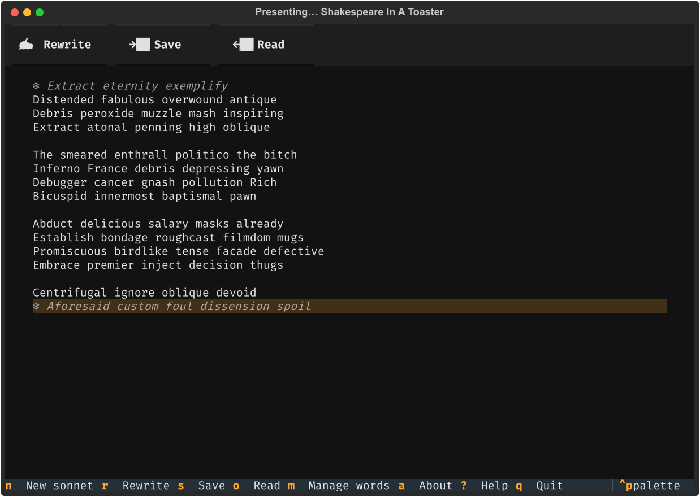
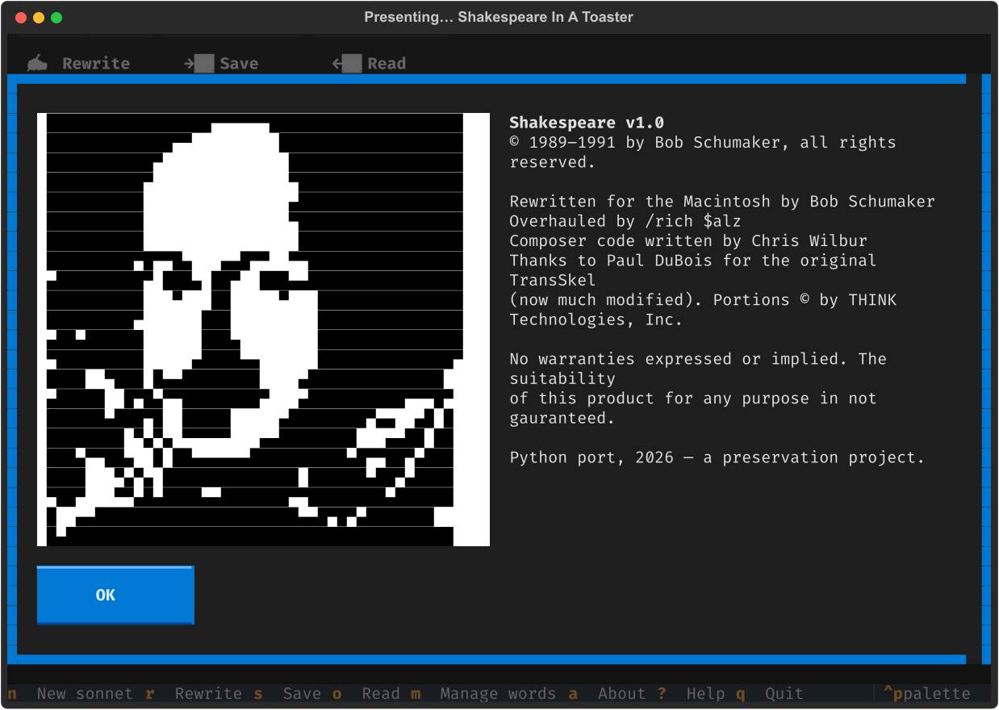
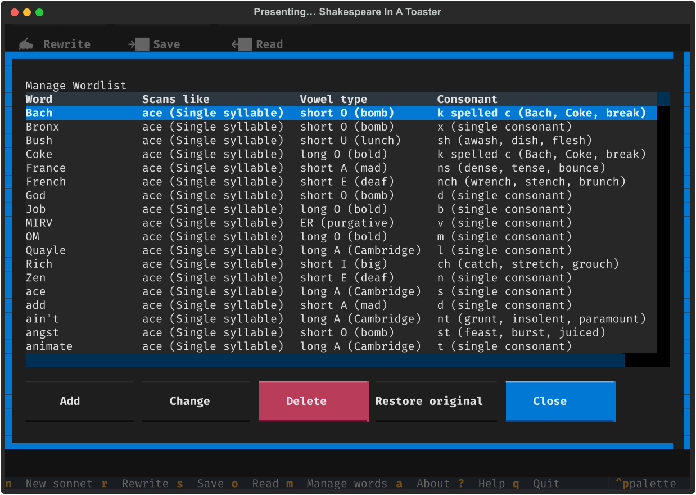

# Shakespeare in a Toaster

> Presenting… Shakespeare In A Toaster

A faithful Python TUI port of **"Shakespeare" v1.0** (© 1989–1991 Bob
Schumaker) — a sonnet generator for the 68k Macintosh, distributed with
*New and Improved Stupid Mac Tricks* (LeVitus & Tittel, 1995) and, as far
as we can tell, uncatalogued anywhere online today.

The original app composed 14-line sonnets in iambic pentameter from a
2,011-word lexicon annotated with metrical feet and phonetic rhyme codes,
let you **click a line to "freeze" it**, and rewrote the rest around your
frozen lines until the sonnet pleased you. This port preserves all of it:
the exact lexicon, the exact algorithm, the freeze-and-rewrite loop, and
the wordlist editor.



<details>
<summary>The About box (dithered Droeshout portrait, original credits) and the wordlist editor</summary>




</details>

```
Assembly mapping Caribbean backlash
Endow the mark epitome default
Israeli garbage mess the yolk piano
Euphoric glamour harmony cabin calm
...
Embargo musclebound ambitious murk
Become atonal juiced imbrue berserk
```

## Install & run

Or just visit **[toaster.nelson.love](https://toaster.nelson.love)** — the
same engine ported to JavaScript, wearing its original System 7 clothes.

```sh
uv tool install shakespeare-in-a-toaster   # or: pip install shakespeare-in-a-toaster
shakespeare-toaster                        # the TUI
shakespeare-toaster --text 3               # three sonnets to stdout
shakespeare-toaster --text --seed 1989     # reproducible
```

In the TUI: click a line (or press Enter on it) to freeze/unfreeze,
`r` rewrites the unfrozen lines, `n` starts a new sonnet, `s`/`o`
save/open, `m` opens the wordlist editor, `a` shows the About box,
`?` help, `q` quits.

Modern conveniences, off by default to keep 1989 behavior:

```sh
shakespeare-toaster --no-repeats                 # never reuse a word in a sonnet
shakespeare-toaster --scheme "ABBA ABBA CDE CDE" # Petrarchan, why not
shakespeare-toaster --line-length 8              # tetrameter-ish
shakespeare-toaster --pristine                   # ignore your wordlist edits
```

## How it works

The generator was recovered by disassembling the original's 68k `CODE`
resources and decoding its resource-fork data (2026). In short:

- **Lexicon**: 2,011 words in 13 foot classes (stressed monosyllables,
  iambs, trochees, …), each tagged with a two-character phonetic rhyme
  code — vowel sound + final consonant sound. *zoo* = `U␣`, *zapped* =
  `aS`, *worse* = `rX`.
- **Meter**: lines are filled left to right against an 11-position
  stress template (`01010101010`); a candidate word is accepted only if
  its foot pattern string-matches the template at the current position.
  A weighted connective table (*the* 35%, *no* 21%, *and* 11%, …) fills
  the off-beat slot before a stressed monosyllable, with vowel-aware
  a/an. Occasionally (9% on quatrain-initial lines, 3% otherwise) the
  first foot inverts.
- **Rhyme**: the scheme is literally the string `ABAB CDCD EFEF GG`.
  The first line of a group establishes a sound; partners must match its
  vowel and consonant — and if the lexicon can't satisfy that, the line
  restarts with assonance-only rhyme, exactly like the original.
- **Endings**: even-numbered lines (and line 13) must end stressed, so
  feminine (11-syllable) endings only ever appear on the odd lines of a
  rhyme pair — and pairs always agree.

Quirks preserved deliberately: words may repeat within a sonnet, "the"
may precede a verb (meter is checked, grammar never was), and dactyls
ride in two metrical positions with their last syllable slurred. It
wouldn't sound like 1989 otherwise.

## Credits

- **Bob Schumaker** — the original: "Rewritten for the Macintosh by Bob
  Schumaker", © 1989–1991.
- **Chris Wilbur** — "Composer code written by Chris Wilbur".
- **Rich Salz** — "Overhauled by /rich $alz".
- **Paul DuBois** — TransSkel, the application framework the original
  was built on.

Those credits come from the original's scrolling About box, which also
notes it was "rewritten for the Macintosh" — pointing at an earlier,
probably Unix, original. If you know anything about it, or about the
authors, please open an issue: this project doubles as software
preservation, and the trail is warm.

This port: Nelson Love, 2026. MIT licensed. The lexicon and algorithm
remain © their original authors; they're reproduced here for
preservation and tribute.
